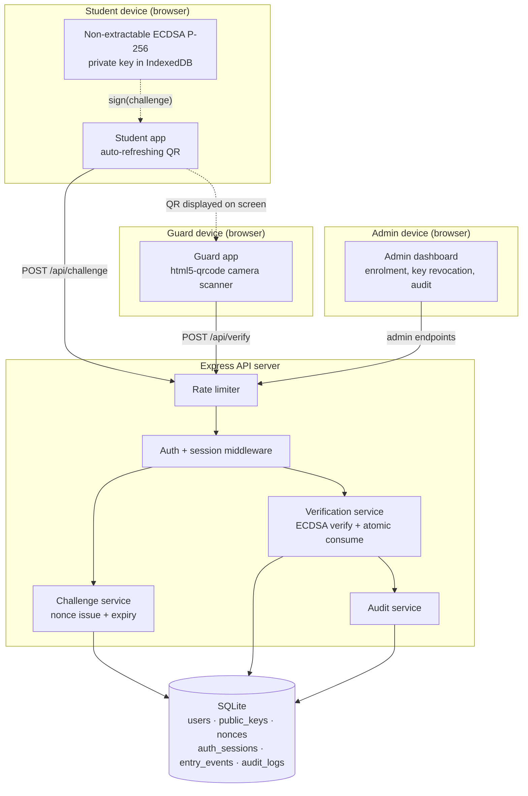
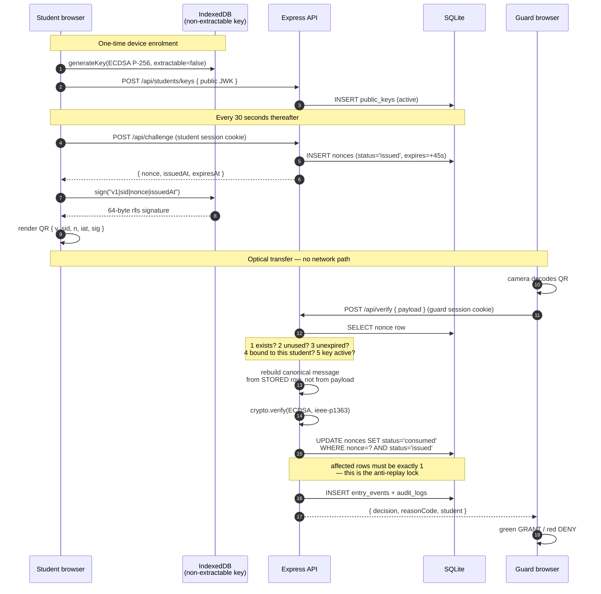
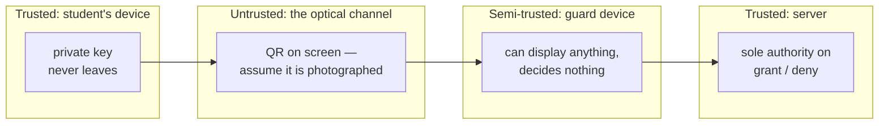

# SentryQR — System Architecture

**Phase 1 deliverable.** Cryptography & Network Security (22CSE71), St. Joseph Engineering College, Mangaluru.

---

## 1. The core idea

A printed ID card or a static QR code is a **bearer credential**: whoever holds a copy of it is treated as the owner. Copying it costs nothing — a photograph is a perfect clone.

SentryQR replaces the bearer credential with a **proof of possession of a private key**. The QR code shown at the gate is not an identity; it is a freshly computed ECDSA signature over a random challenge that the server issued seconds earlier and will accept exactly once. A photograph of that QR is worthless within 45 seconds, and it was never usable by anyone other than the student it was issued to.

Three properties do the work:

| Property | Mechanism | Attack it defeats |
|---|---|---|
| Freshness | Server-issued random nonce, 45 s expiry | Screenshot sharing |
| Single use | Nonce consumed atomically on first successful verify | Replay |
| Non-repudiation | ECDSA signature by a non-extractable device key | Impersonation, forgery |

---

## 2. Components



The single most important line in that diagram is the **dotted** one. The signed payload travels from student to guard optically, over the air gap of a camera looking at a screen. It is never relayed between the two devices over the network, so there is no channel for a man-in-the-middle to sit on. Both devices talk only to the server, each over its own TLS connection (Phase 6).

### Responsibilities

| Component | Owns |
|---|---|
| Student app | Key generation, key storage, signing, QR rendering, refresh timing |
| Guard app | Camera capture, QR decode, decision display. **Verifies nothing itself** |
| Admin dashboard | Student enrolment, key revocation, override approval, audit review |
| Express API | Nonce issuance, signature verification, nonce consumption, session and audit state |
| SQLite | Durable state |

The guard app is deliberately dumb. It decodes a QR and asks the server what to do. If a guard's device were fully compromised, the attacker gains the ability to *display* a fake GRANT banner to themselves, but gains no ability to actually authenticate anyone — the `entry_events` table records only what the server decided.

---

## 3. End-to-end flow



### Why step 7 (rebuild from stored row) matters

The QR payload carries `sid` and `iat` so the server can look things up, but those fields are **attacker-controlled input**. The server therefore reconstructs the signed message using the `user_id` and `issued_at` it stored when it issued the nonce. An attacker who edits `sid` in the payload to impersonate another student changes nothing about the message being verified — the signature is checked against the original values and fails.

### Why step 9 uses a conditional UPDATE

Two guards (or an attacker firing two requests in parallel) can submit the same valid QR at the same instant. A read-then-write check — `SELECT status; if issued then UPDATE` — has a window between the read and the write in which both requests see `issued`. The conditional `UPDATE ... WHERE status='issued'` pushes the check into the database's own atomicity: whichever statement runs second affects zero rows, and that request is denied with `NONCE_REUSED`.

---

## 4. Trust boundaries



The design assumes the QR **will** be photographed and shared. It is not a secret. Its security comes entirely from being useless after 45 seconds or one use, whichever comes first.

---

## 5. Cryptographic choices

| Choice | Value | Reason |
|---|---|---|
| Signature algorithm | ECDSA P-256 | 64-byte signature vs RSA-2048's 256. Keeps the QR near version 9 rather than version 20+, which matters when scanning a phone screen with a phone camera |
| Hash | SHA-256 | Paired with P-256 at a matched 128-bit security level |
| Signature encoding | IEEE P1363 (raw `r‖s`) | What WebCrypto emits. Node must be told `dsaEncoding: 'ieee-p1363'` or it expects DER and rejects every valid signature |
| Nonce | 32 bytes from `crypto.randomBytes` | Collision and guessing are both infeasible |
| Password hashing | scrypt, 16-byte salt, `timingSafeEqual` | Memory-hard, and built into `node:crypto` with no dependency |
| Key extractability | `false` | The private key cannot be exported by any JavaScript, including our own |

### Canonical message format

Both sides must hash byte-identical input. JSON key ordering is not guaranteed to survive across engines, so the signed message is a fixed-order delimited string rather than serialized JSON:

```
v1|<studentUserId>|<nonce>|<issuedAtEpochMs>
```

The leading `v1` is a version tag, so the format can change later without silently verifying an old payload under new rules. The nonce is base64url, which contains no `|`, so the field separator is unambiguous.

---

## 6. Technology

| Layer | Choice | Note |
|---|---|---|
| Runtime | Node.js 22.5+ | `node:sqlite`, `node:test`, `node:crypto` all built in |
| HTTP | Express 4 | The only backend runtime dependency |
| Storage | SQLite via `node:sqlite` | No DB server to install; the file is the database |
| Frontend | React 18 + Vite 5 | One SPA, role-based routes |
| QR encode | `qrcode` | Renders to canvas |
| QR decode | `html5-qrcode` | Wraps `getUserMedia` |
| Crypto (client) | WebCrypto `SubtleCrypto` | Native, non-extractable keys |
| Crypto (server) | `node:crypto` | Native |

The dependency list is deliberately short. Every cryptographic operation in the system runs on a platform primitive, not on a third-party library — which is both better security practice and easier to defend in a viva.

---

## 7. Request lifecycle

Every API request passes through the same chain:

```
rate limiter  →  session cookie lookup  →  role check  →  input validation  →  handler  →  audit write
```

Rate limiting sits first so that a flood costs a map lookup rather than a database query. Audit writes happen for security-relevant outcomes — every verification decision, every key registration and revocation, every login success and failure.

---

## 8. Deferred to Phase 6+

- TLS. Development runs on `http://localhost`, which browsers already treat as a secure context, so WebCrypto and camera access work. A LAN demo with a phone as the scanner needs a certificate first.
- The `Secure` cookie flag, already behind a config switch in `config.js`.
- Formal penetration testing and the written test report (Phase 7).
- Deployment (Phase 8).
