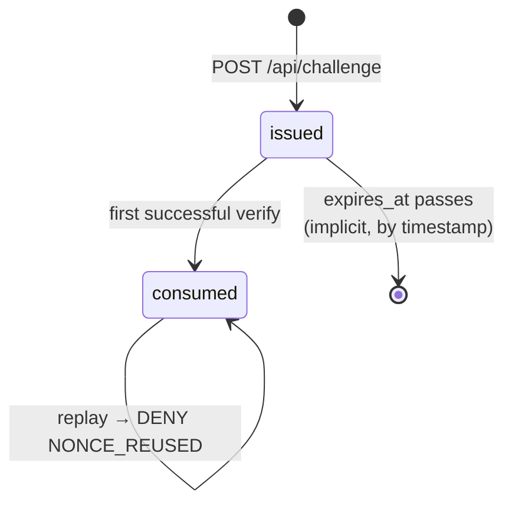

# SentryQR — Database Schema

**Phase 1 deliverable.** SQLite, accessed through `node:sqlite`. Canonical DDL lives in [backend/src/db/schema.sql](../backend/src/db/schema.sql); this document explains it.

---

## Naming: two different things called "session"

The roadmap uses "session" for both a login and an entry attempt. They have different lifetimes, owners, and security properties, so the schema names them separately:

- **`auth_sessions`** — a login. Created at `POST /api/auth/login`, backs the `sentryqr_sid` cookie, lives hours.
- **`entry_events`** — one gate decision. Created at `POST /api/verify`, immutable, lives forever.

---

## Overview

```mermaid
erDiagram
    users ||--o| students        : "profile (role=student)"
    users ||--o{ public_keys     : "owns"
    users ||--o{ nonces          : "issued to"
    users ||--o{ auth_sessions   : "logged in as"
    users ||--o{ entry_events    : "subject of"
    users ||--o{ entry_events    : "verified by (guard)"
    users ||--o{ audit_logs      : "actor"
    users ||--o{ override_requests : "requested by (guard)"
    nonces ||--o| entry_events   : "consumed by"

    users {
        integer id PK
        text    username UK
        text    password_hash
        text    password_salt
        text    role
        text    full_name
        integer active
        integer created_at
    }
    students {
        integer user_id PK_FK
        text    roll_no UK
        text    room_no
        text    hostel_block
    }
    public_keys {
        integer id PK
        integer user_id FK
        text    kid UK
        text    jwk
        text    algorithm
        integer active
        integer created_at
        integer revoked_at
    }
    nonces {
        text    nonce PK
        integer user_id FK
        integer issued_at
        integer expires_at
        text    status
        integer consumed_at
    }
    entry_events {
        integer id PK
        integer user_id FK
        integer guard_user_id FK
        text    nonce
        text    decision
        text    reason_code
        integer created_at
    }
    audit_logs {
        integer id PK
        integer ts
        text    event_type
        integer actor_user_id
        integer subject_user_id
        text    decision
        text    reason_code
        text    detail
        text    ip
    }
    override_requests {
        integer id PK
        integer guard_user_id FK
        integer student_user_id FK
        text    reason
        text    status
        integer decided_by FK
        text    decision_note
    }
```

All timestamps are **epoch milliseconds stored as INTEGER**, never text. SQLite has no native date type, and integers compare and index correctly without any parsing.

---

## Tables

### `users`

One row per human. `role` is constrained to `student | guard | admin`.

Passwords are stored as scrypt output with a per-user 16-byte random salt, in two hex columns (`password_hash`, `password_salt`). Verification uses `crypto.timingSafeEqual` so comparison time does not leak information about how much of the hash matched.

`active = 0` suspends the account: login is refused, and any in-flight verification for that student denies with `STUDENT_INACTIVE`.

### `students`

Profile fields that only apply to the student role — `roll_no`, `room_no`, `hostel_block`. Kept out of `users` so guard and admin rows do not carry four permanently-null columns. `user_id` is both primary and foreign key, enforcing the one-to-at-most-one relationship.

### `public_keys`

The simulated certificate authority. `jwk` holds the serialized public JWK as text; `kid` is a short key identifier derived from a SHA-256 hash of the JWK, used for display and log correlation.

**Invariant: at most one active key per user.** Enforced by a partial unique index:

```sql
CREATE UNIQUE INDEX idx_public_keys_one_active
    ON public_keys(user_id) WHERE active = 1;
```

This is the schema-level expression of threat T6. Re-enrolment deactivates the old key and inserts the new one inside a single transaction; the index makes a state with two live keys unrepresentable, rather than merely unlikely.

Revocation is soft — `active = 0`, `revoked_at` set. Rows are never deleted, because an old key is needed to interpret historical entry events.

### `nonces`

The heart of the anti-replay design.

| Column | Purpose |
|---|---|
| `nonce` | 32 random bytes, base64url. Primary key |
| `user_id` | The student this nonce was issued to. **The authoritative binding** |
| `issued_at` | Used to rebuild the canonical signed message |
| `expires_at` | `issued_at + 45000` |
| `status` | `issued` → `consumed` |
| `consumed_at` | Set on transition |



Expiry is **implicit** — a row is expired when `now >= expires_at`, with no background job flipping a status column. A sweeper that fell behind would otherwise create a window in which an expired nonce still read as `issued`. Comparing against the clock at verification time cannot fall behind. A periodic delete of rows older than an hour is housekeeping only; correctness does not depend on it running.

`user_id` here is what makes the identity check work. The QR's `sid` field is a claim by the client; `nonces.user_id` is what the server recorded when it issued the challenge. Step 6 of verification compares them, and every subsequent step uses the stored value.

### `entry_events`

One immutable row per gate decision, including denials. `nonce` is stored as plain text rather than a foreign key, so an event referencing an unknown nonce (an entirely fabricated QR) is still recordable.

`decision` is `GRANT | DENY`; `reason_code` carries the detail. `guard_user_id` is null for override-created events, where `decided_by` on the override row is the responsible party.

### `audit_logs`

Append-only security log, broader than `entry_events` — it also covers logins, key lifecycle, and rate limiting. `detail` is a JSON text column for event-specific fields (nonce, key id, target user) without a column per event type.

The two tables overlap on purpose. `entry_events` is the operational view an admin scans for gate activity; `audit_logs` is the forensic view covering everything security-relevant.

### `auth_sessions`

`id` is 32 random bytes, base64url — the cookie value. Sessions carry `expires_at` and a `revoked` flag; logout sets `revoked = 1` rather than deleting, so the log can show when the session ended.

### `override_requests`

Guard-raised, admin-decided. `status` moves `pending → approved | denied`. Approval writes a corresponding `entry_events` row with `reason_code = 'MANUAL_OVERRIDE'`, so a manual entry is never invisible in the entry history.

---

## Indexes

```sql
CREATE INDEX idx_nonces_user       ON nonces(user_id, issued_at DESC);
CREATE INDEX idx_nonces_expiry     ON nonces(expires_at);
CREATE INDEX idx_entry_user        ON entry_events(user_id, created_at DESC);
CREATE INDEX idx_entry_created     ON entry_events(created_at DESC);
CREATE INDEX idx_audit_ts          ON audit_logs(ts DESC);
CREATE INDEX idx_audit_type        ON audit_logs(event_type, ts DESC);
CREATE INDEX idx_sessions_expiry   ON auth_sessions(expires_at);
CREATE UNIQUE INDEX idx_public_keys_one_active ON public_keys(user_id) WHERE active = 1;
```

The nonce lookup on the verification path is a primary-key hit, which is the fastest thing SQLite can do — appropriate, since it is the query on the latency-critical path at the gate.

---

## Pragmas

```sql
PRAGMA journal_mode = WAL;
PRAGMA foreign_keys = ON;
PRAGMA busy_timeout = 5000;
```

WAL lets readers proceed during a write, which matters when a guard verification and an admin audit query overlap. `foreign_keys` is off by default in SQLite and must be enabled per connection. `busy_timeout` makes concurrent writers wait rather than immediately failing.

---

## Concurrency and the atomic consume

The one place correctness depends on database behaviour:

```sql
UPDATE nonces
   SET status = 'consumed', consumed_at = ?
 WHERE nonce = ? AND status = 'issued';
```

The handler checks `changes === 1`. Two simultaneous verifications of the same QR both pass the earlier read-only checks, but SQLite serializes the writes: the first `UPDATE` matches one row, the second matches zero because `status` is no longer `'issued'`. The loser is denied `NONCE_REUSED`.

The equivalent read-then-write — `SELECT status` then `UPDATE` — has a gap between the two statements in which both requests observe `issued`, and both proceed. That is a genuine time-of-check-to-time-of-use bug, and it is exactly the bug an attacker firing parallel requests would try to hit. `test/attacks.test.js` covers it.

---

## Retention

| Table | Policy |
|---|---|
| `nonces` | Deletable an hour after expiry; no correctness dependency |
| `auth_sessions` | Deletable after expiry |
| `entry_events` | Never deleted — the entry record |
| `audit_logs` | Never deleted — the forensic record |
| `public_keys` | Never deleted; revoked in place |
